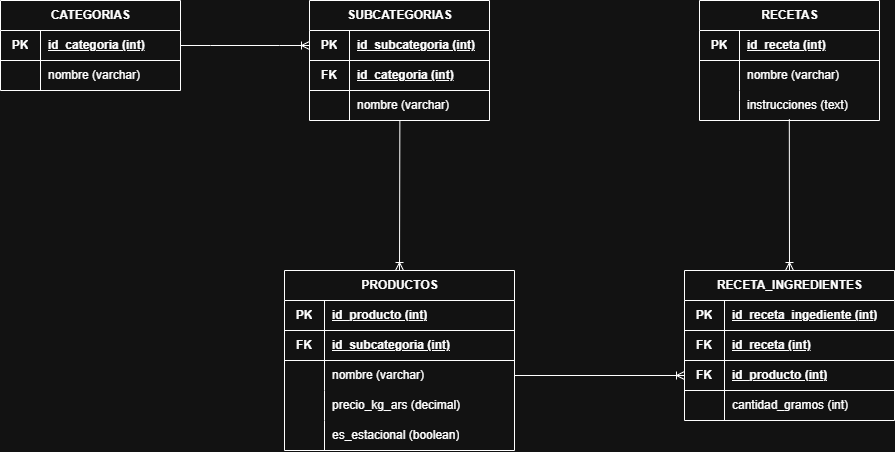
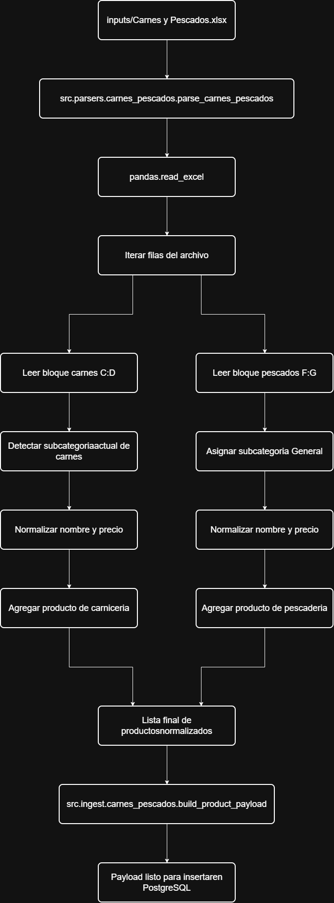
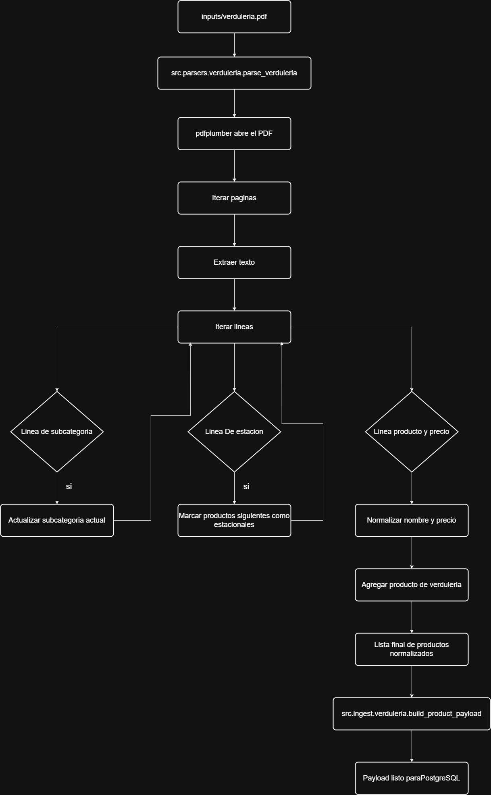
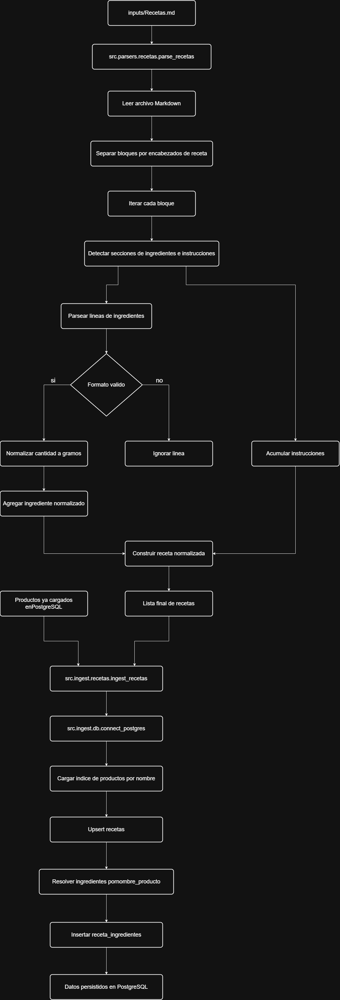
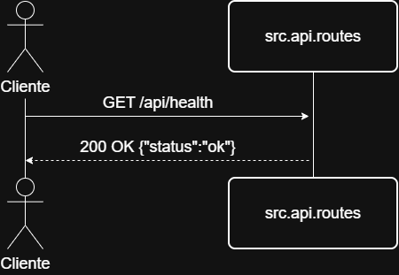
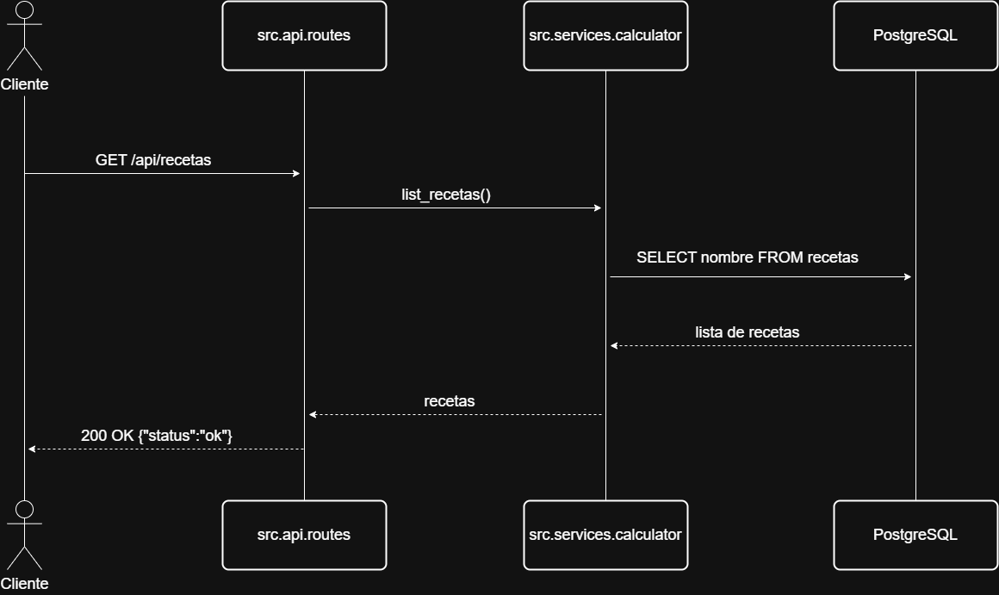
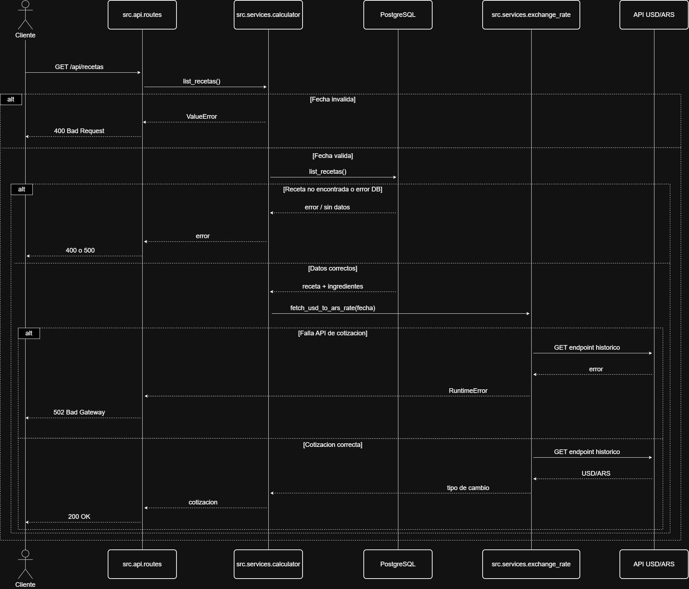

# WNS Challenge

## Descripcion del proyecto

Esta aplicacion resuelve la consigna de cotizar recetas usando tres fuentes de datos entregadas por el desafio:

- `inputs/Carnes y Pescados.xlsx`
- `inputs/verduleria.pdf`
- `inputs/Recetas.md`

El flujo implementado es:

1. parsear y normalizar los archivos de entrada
2. persistir los datos en PostgreSQL
3. consumir PostgreSQL para resolver recetas, ingredientes y precios
4. consultar la cotizacion historica USD/ARS
5. exponer el resultado por API HTTP, CLI y un frontend minimo

La aplicacion calcula el costo total del plato en pesos argentinos y dolares estadounidenses, redondeando cada compra al siguiente multiplo de `250 g`, tal como pide la consigna.

## Caracteristicas

- Parseo de multiples formatos: Excel, PDF y Markdown.
- Persistencia normalizada en PostgreSQL.
- API HTTP para consultar recetas y cotizaciones.
- Frontend web integrado para probar la aplicacion.
- Calculo de costos con redondeo a multiplos de `250 g`.
- Integracion con API historica de tipo de cambio USD/ARS.
- Validacion de fechas dentro de los ultimos `30` dias.
- Setup reproducible con Docker o Python local.

## Datos

El proyecto procesa:

- `10` recetas en formato Markdown.
- `29` productos de carnes y pescados en Excel.
- `16` productos de verduras en PDF.

Los datos se normalizan y se almacenan en PostgreSQL despues de ejecutar la ingesta.

## Tecnologias usadas

- `Python`: lenguaje principal para parseo, ingesta, logica de negocio y API.
- `PostgreSQL`: base de datos relacional para persistir productos, recetas e ingredientes.
- `FastAPI`: framework para exponer la API HTTP y servir el frontend.
- `Uvicorn`: servidor ASGI para ejecutar la aplicacion FastAPI.
- `Docker / Docker Compose`: entorno reproducible para levantar PostgreSQL y correr la aplicacion.
- `pandas`: lectura y normalizacion del archivo Excel de carnes y pescados.
- `openpyxl`: motor usado por `pandas` para procesar el archivo `.xlsx`.
- `pdfplumber`: lectura y extraccion de texto del PDF de verduleria.
- `psycopg`: conexion y operaciones contra PostgreSQL desde Python.

## Instalacion y uso

Los scripts `.ps1` de esta seccion estan pensados para ejecutarse en `Windows` con `PowerShell`.

### Opcion 1: Docker

Es el camino mas simple para evaluar el proyecto porque no requiere instalar Python ni PostgreSQL localmente.

**Requisitos**

- `Docker`
- `Docker Compose`

Segun la instalacion del equipo, `Docker Compose` puede venir incluido con Docker Desktop o requerir instalacion aparte.

**Comando de instalación**

```powershell
powershell -ExecutionPolicy Bypass -File .\scripts\setup_docker.ps1
```

Ese comando:

- construye las imagenes necesarias
- levanta PostgreSQL
- crea la base de datos
- aplica el schema
- ingiere todos los datos
- levanta la API y el frontend

En Docker, PostgreSQL puede crear la base y aplicar el schema durante la inicializacion del contenedor. Por eso, el resumen de `bootstrap` puede mostrar `no` en esos campos aunque el reset se haya hecho correctamente.

Cuando termina, la aplicacion queda disponible en:

- Frontend: `http://127.0.0.1:8000/`

**Reset Docker**

Si quieres borrar contenedores, volumen e imagenes locales del proyecto antes de volver a probar la instalacion:

```powershell
powershell -ExecutionPolicy Bypass -File .\scripts\reset_docker.ps1
```


### Opcion 2: Python local

Este camino usa Python local para ejecutar la aplicacion, pero requiere tener PostgreSQL ya instalado y corriendo en la maquina.

**Requisitos**

- `Python 3`
- `PostgreSQL`

**Comando de instalación**

```powershell
powershell -ExecutionPolicy Bypass -File .\scripts\setup_local.ps1
```

Ese comando:

- crea `.venv` si no existe
- instala todas las dependencias de Python
- crea la base de datos
- aplica el schema
- ingiere todos los datos
- levanta la API y el frontend

Cuando termina, la aplicacion queda disponible en:

- Frontend: `http://127.0.0.1:8000/`

**Reset local**

Si quieres volver a probar la instalacion local desde el estado previo del proyecto:

```powershell
powershell -ExecutionPolicy Bypass -File .\scripts\reset_local.ps1
```

Ese comando:

- elimina la base de datos del proyecto si existe
- elimina `.venv`

No desinstala `Python` ni `PostgreSQL` del sistema.
Si `.venv` no existe, el script no puede eliminar la base del proyecto desde Python.


## Frontend y API

### Frontend

El frontend esta integrado en FastAPI y se sirve automaticamente en `http://127.0.0.1:8000/`.

**Uso**

1. Inicia la aplicacion con alguno de los comandos de la seccion `Instalacion y uso`.
2. Abre tu navegador en `http://127.0.0.1:8000/`.
3. Selecciona una receta y una fecha.
4. Haz clic en `Cotizar receta`.

El frontend consume los endpoints de la API para mostrar los resultados.

### API

### Endpoints principales

- `GET /api/health`
- `GET /api/recetas`
- `GET /api/cotizacion?receta=...&fecha=YYYY-MM-DD`
- `GET /docs`

## Detalles tecnicos

### Redondeo de cantidades

Las cantidades se redondean siempre hacia arriba al siguiente multiplo de `250 g`.

- `250 g -> 250 g`
- `251 g -> 500 g`
- `800 g -> 1000 g`

### Tipo de cambio

El tipo de cambio USD/ARS se obtiene desde endpoints configurables en `CURRENCY_API_URLS`.

Endpoint principal por defecto:

```text
https://cdn.jsdelivr.net/npm/@fawazahmed0/currency-api@{date}/v1/currencies/usd.json
```

La fecha debe enviarse en formato `YYYY-MM-DD` y estar dentro de los ultimos 30 dias.

## Probar endpoints en Postman

Usar metodo `GET` sobre estas URLs:

- `http://127.0.0.1:8000/api/health`
- `http://127.0.0.1:8000/api/recetas`
- `http://127.0.0.1:8000/api/cotizacion?receta=Asado%20con%20ensalada%20criolla&fecha=YYYY-MM-DD`

Para cotizar, reemplazar `YYYY-MM-DD` por una fecha valida dentro de los ultimos 30 dias.

## Testeo manual

Ademas del frontend y la API, el proyecto mantiene comandos auxiliares para validar parseo, ingesta y cotizacion desde terminal.

### Inspeccionar parseos

**Python local**

```powershell
.\.venv\Scripts\python.exe -m src.cli.inspect_carnes_pescados
.\.venv\Scripts\python.exe -m src.cli.inspect_verduleria
.\.venv\Scripts\python.exe -m src.cli.inspect_recetas
```

**Docker**

```powershell
docker compose run --rm python python -m src.cli.inspect_carnes_pescados
docker compose run --rm python python -m src.cli.inspect_verduleria
docker compose run --rm python python -m src.cli.inspect_recetas
```

### Ejecutar ingestas puntuales

**Python local**

```powershell
.\.venv\Scripts\python.exe -m src.ingest.carnes_pescados
.\.venv\Scripts\python.exe -m src.ingest.verduleria
.\.venv\Scripts\python.exe -m src.ingest.recetas
```

**Docker**

```powershell
docker compose run --rm python python -m src.ingest.carnes_pescados
docker compose run --rm python python -m src.ingest.verduleria
docker compose run --rm python python -m src.ingest.recetas
```

### Probar la cotizacion por CLI

**Python local**

```powershell
.\.venv\Scripts\python.exe -m src.cli.cotizar_receta --listar-recetas
.\.venv\Scripts\python.exe -m src.cli.cotizar_receta --receta "Asado con ensalada criolla" --fecha YYYY-MM-DD
```

**Docker**

```powershell
docker compose run --rm python python -m src.cli.cotizar_receta --listar-recetas
docker compose run --rm python python -m src.cli.cotizar_receta --receta "Asado con ensalada criolla" --fecha YYYY-MM-DD
```

## Arquitectura

### DER

Vista general de las tablas y relaciones principales de la base de datos.



### Flujo general

- `src/parsers/`: parseo y normalizacion de archivos fuente
- `src/ingest/`: creacion de base, schema e ingesta de datos en PostgreSQL
- `src/services/`: calculo de cotizacion y consulta de tipo de cambio
- `src/api/`: API HTTP y frontend

### Diagramas de flujo de procesamiento

Excel `Carnes y Pescados.xlsx`:

Lectura, normalizacion e ingesta de productos y precios.



PDF `verduleria.pdf`:

Lectura, normalizacion e ingesta de verduras y precios.



Markdown `Recetas.md`:

Lectura, normalizacion e ingesta de recetas e ingredientes.



### Diagramas de secuencia de la API

`GET /api/health`:

Chequeo de disponibilidad de la API.



Ejemplo:

```http
GET http://127.0.0.1:8000/api/health
```

Respuesta:

```json
{
  "status": "ok"
}
```

`GET /api/recetas`:

Consulta de recetas cargadas en la base.



Ejemplo:

```http
GET http://127.0.0.1:8000/api/recetas
```

Respuesta:

```json
{
    "recetas": [
        "Asado con ensalada criolla",
        "Berenjenas rellenas con carne picada",
        "Cerdo con batatas al horno",
        "Ensalada de atún (merluza) con espinaca",
        "Entraña con ensalada tibia de remolacha",
        "Lomo salteado con brócoli y morrón",
        "Pejerrey al horno con verduras de estación",
        "Pollo al horno con papas y zanahorias",
        "Salteado de carne con choclo y acelga",
        "Supremas de pollo con puré de zapallo y brócoli"
    ]
}
```

`GET /api/cotizacion`:

Proceso completo de cotizacion de una receta.



Ejemplo:

```http
GET http://127.0.0.1:8000/api/cotizacion?receta=Asado%20con%20ensalada%20criolla&fecha=2026-03-12
```

Respuesta:

```json
{
    "cotizacion": {
        "receta": "Asado con ensalada criolla",
        "fecha": "2026-03-12",
        "cotizacion_usd_ars": "1395.38536501",
        "instrucciones": "Cortar las verduras en cubos y mezclarlas con un poco de sal. Asar la carne a la parrilla hasta el punto deseado y acompañar con la ensalada.",
        "ingredientes": [
            {
                "nombre_producto": "Asado de tira",
                "cantidad_receta_gramos": 1000,
                "cantidad_compra_gramos": 1000,
                "precio_kg_ars": "6800.00",
                "subtotal_ars": "6800.00"
            },
            {
                "nombre_producto": "Tomate",
                "cantidad_receta_gramos": 250,
                "cantidad_compra_gramos": 250,
                "precio_kg_ars": "1200.00",
                "subtotal_ars": "300.00"
            },
            {
                "nombre_producto": "Cebolla",
                "cantidad_receta_gramos": 400,
                "cantidad_compra_gramos": 500,
                "precio_kg_ars": "900.00",
                "subtotal_ars": "450.00"
            },
            {
                "nombre_producto": "Morrón",
                "cantidad_receta_gramos": 250,
                "cantidad_compra_gramos": 250,
                "precio_kg_ars": "1500.00",
                "subtotal_ars": "375.00"
            }
        ],
        "total_ars": "7925.00",
        "total_usd": "5.68"
    }
}
```

## Estructura del repositorio

```text
WNS-instancia-evaluativa/
|-- src/
|   |-- parsers/                       # Parseos y normalizaciones de archivos
|   |   |-- carnes_pescados.py         # Parseo y normalización de Excel de carnes y pescados
|   |   |-- recetas.py                 # Parseo y normalización de recetas en Markdown
|   |   `-- verduleria.py              # Parseo y normalización de PDF de verduras
|   |
|   |-- ingest/                        # Ingestas puntuales por fuente
|   |   |-- carnes_pescados.py         # Carga productos del Excel
|   |   |-- db.py                      # Conexion y settings de PostgreSQL
|   |   |-- productos.py               # Upserts reutilizables de productos
|   |   |-- recetas.py                 # Carga recetas e ingredientes
|   |   `-- verduleria.py              # Carga productos del PDF
|   |
|   |-- setup/                         # Inicializacion completa del proyecto
|   |   |-- bootstrap.py               # Crea DB, aplica schema e ingiere datos
|   |   `-- reset_project.py           # Elimina la base del proyecto
|   |
|   |-- services/                      # Logica de negocio
|   |   |-- calculator.py              # Calcula el costo de una receta
|   |   `-- exchange_rate.py           # Consulta el tipo de cambio USD/ARS
|   |
|   |-- api/                           # API HTTP y frontend
|   |   |-- app.py                     # Configuracion principal de FastAPI
|   |   |-- routes.py                  # Endpoints HTTP
|   |   `-- static/
|   |       |-- index.html             # Interfaz web minima
|   |       |-- styles.css             # Estilos del frontend
|   |       `-- app.js                 # Consumo de la API desde el navegador
|   |
|   `-- cli/                           # Herramientas auxiliares por terminal
|       |-- cotizar_receta.py          # Cotizacion desde consola
|       |-- inspect_carnes_pescados.py # Inspeccion del parseo de Excel
|       |-- inspect_recetas.py         # Inspeccion del parseo de Markdown
|       `-- inspect_verduleria.py      # Inspeccion del parseo de PDF
|
|-- inputs/                            # Archivos entregados por la consigna
|   |-- Carnes y Pescados.xlsx         
|   |-- Recetas.md                     
|   `-- verduleria.pdf              
|   
|-- docker/
|   |-- postgres/init/01_schema.sql    # Schema inicial de PostgreSQL
|   `-- python/Dockerfile  
|            
|-- scripts/                           
|   |-- reset_docker.ps1              # Borra contenedores, volumen e imagenes locales
|   |-- reset_local.ps1               # Elimina la base del proyecto y `.venv`
|   |-- setup_docker.ps1               # Preparacion y arranque con Docker
|   `-- setup_local.ps1                # Preparacion y arranque en local
|
|-- docs/                              # Diagramas del proyecto
|-- docker-compose.yml                 
|-- requirements.txt                   
`-- README.md                          
```

## Decisiones tecnicas y diseño

### Fortalezas

- Modularidad por capas y por fuente de datos.
- Ingesta idempotente para evitar duplicados.
- Setup con un comando por camino (`Docker` o `Python local`).
- API y frontend listos para demo y validacion manual.
- Validaciones claras para recetas, fechas y errores de integracion externa.

### Debilidades y limitaciones

- El camino `Python local` requiere PostgreSQL previamente instalado y corriendo.
- La configuracion actual de `.env` entre `Docker` y `Python local` esta algo acoplada y podria unificarse mejor.
- La cotizacion depende de la disponibilidad de una API externa USD/ARS.
- El frontend es deliberadamente simple y esta pensado como demo funcional.
- No hay autenticacion ni control de acceso en la API.
- No hay una suite automatizada de tests end-to-end.

### Asunciones

- Los precios de carnes, pescados y verduras se consideran constantes en el tiempo.
- La compra de cada ingrediente se redondea al siguiente multiplo de `250 g`.
- La fecha de cotizacion debe estar dentro de los ultimos `30` dias.
- Los nombres de ingredientes de las recetas deben coincidir con productos ya cargados.
- La carga de datos puede ejecutarse mas de una vez sin duplicar registros.

### Limitaciones y condiciones de operacion

- Los scripts `.ps1` estan pensados para `Windows` con `PowerShell`.
- `reset_docker.ps1` elimina contenedores, volumen e imagenes locales del proyecto.
- `reset_local.ps1` elimina la base del proyecto y `.venv`, pero no desinstala `Python` ni `PostgreSQL`.
- En Docker, PostgreSQL puede crear la base y aplicar el schema antes del `bootstrap`.
- La cotizacion requiere conexion saliente a los endpoints configurados en `CURRENCY_API_URLS`.

### Escalabilidad y deployment en produccion

#### Cambios recomendados para produccion

**Backend y API**

- Ejecutar FastAPI detras de un servidor ASGI de produccion y un reverse proxy.
- Agregar cache para cotizaciones y consultas frecuentes.
- Incorporar autenticacion y autorizacion si la API deja de ser publica.
- Sumar logging estructurado, metricas y monitoreo.
- Implementar rate limiting y politicas de timeout mas estrictas.
- Externalizar configuracion sensible por variables de entorno o secretos.

**Infraestructura**

- Separar base de datos, API y frontend en servicios independientes.
- Mover PostgreSQL a una instancia administrada o persistencia dedicada.
- Agregar HTTPS, health checks y politicas de restart mas robustas.
- Incorporar CI/CD para despliegues automatizados.
- Considerar balanceo de carga y escalado horizontal si aumenta el trafico.

**Frontend**

- Separar el frontend del backend si la interfaz crece en complejidad.
- Incorporar un proceso de build y optimizacion de assets.
- Mejorar el manejo de errores y el feedback visual al usuario.
- Evaluar un framework frontend dedicado si la demo evoluciona a producto.

**Datos**

- Versionar mejor los datos normalizados para recalculos y auditoria.
- Automatizar la carga de archivos con jobs programados o eventos.
- Agregar validaciones de integridad y trazabilidad por corrida de ingesta.
